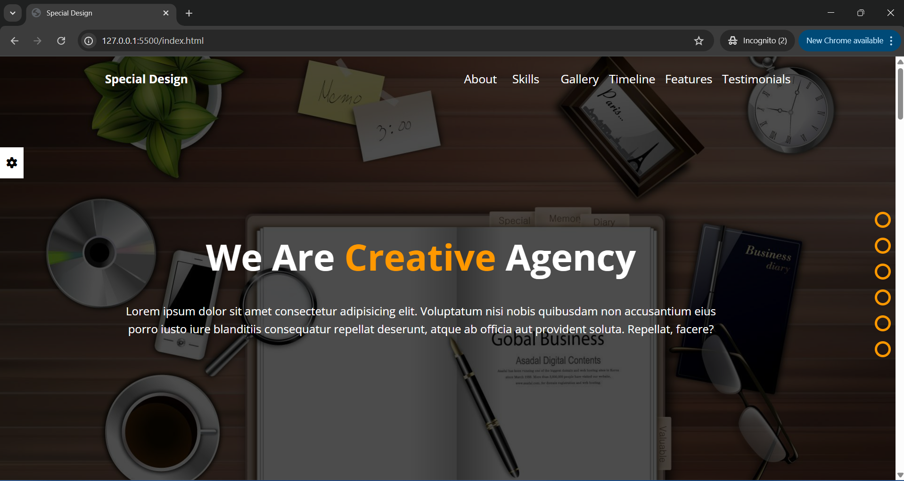

# Special-Design



Interactive and Responsive Design With Image Slider and JS Functionality in each page

---

## Live Demo

**[View Live Demo Here](https://mohammed-soliman144.github.io/Special-Design/)**

---

## Features:

**1- Responsive Design:** Works seamlessly on different screen sizes such desktops, tablets and smart phones.

**2- Interactive UI:** Validation Form, Smoothly Scrolling, Change Image Slider automatically, move between themes and verify User Login by using Cryptographic Universel Unique Identifier.

**3- Animation UI:** In Some of Section, specially in header of webpage.

**4- JS Functionality:** Using LocalStorage, URL and Verify User Login.

---

## Technologies Used:

**1- HTML5**
**2- CSS3**
**3- JavaScript (ES6+)**

---

### How To Run Locally:

**Clone The Repo:**

```bash command
git clone https://github.com/mohammed-soliman144/Special-Design.git
```

**Navigate To The Project Directory:**
`bash command cd Special-Design`

**Open 'index.html'** in your browser.

---

## Author:

**Mohammed Soliman**

**[Github Profile](https://github.com/mohammed-soliman144)**

**[Business Email](mohammed-soliman144@gmail.com)**

---

## License:

This Project is Liscensed under the MIT License.
